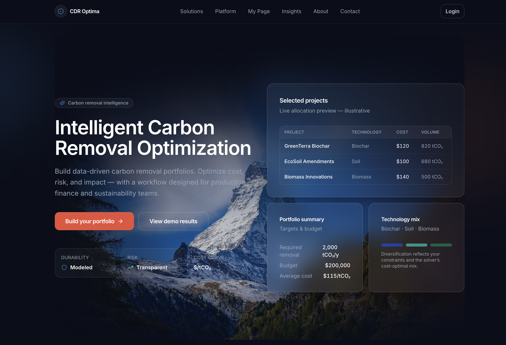
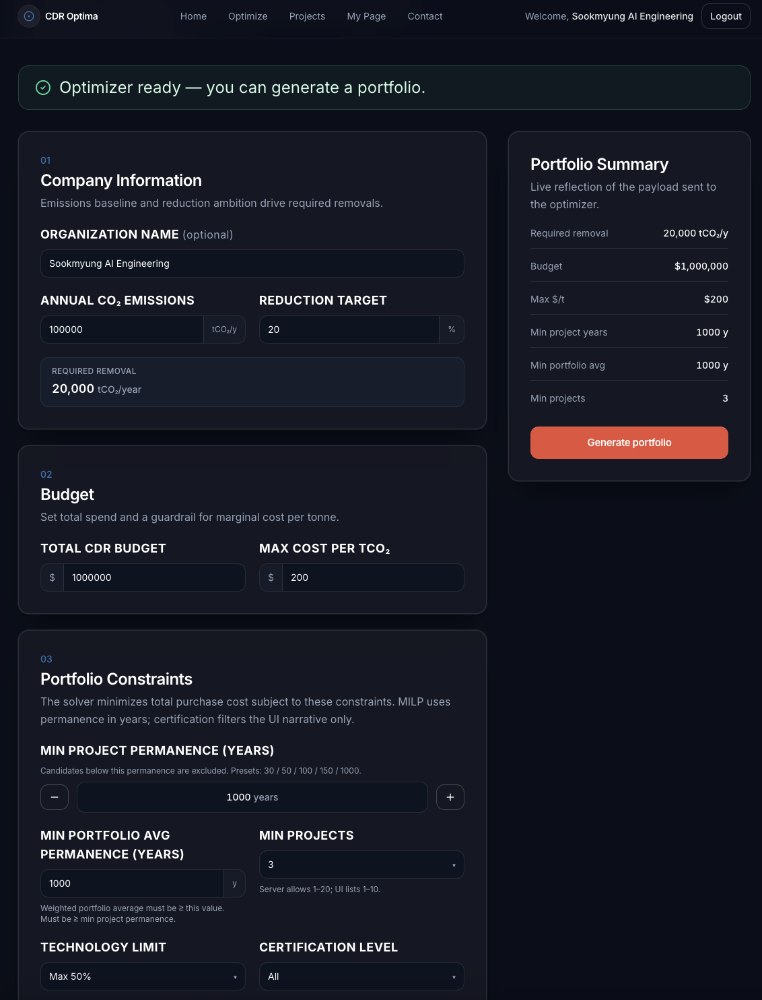
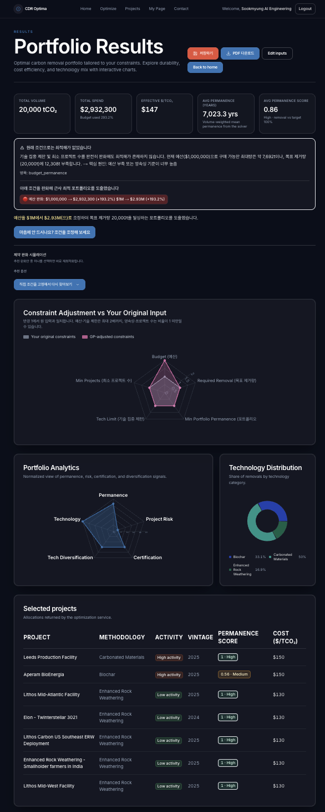
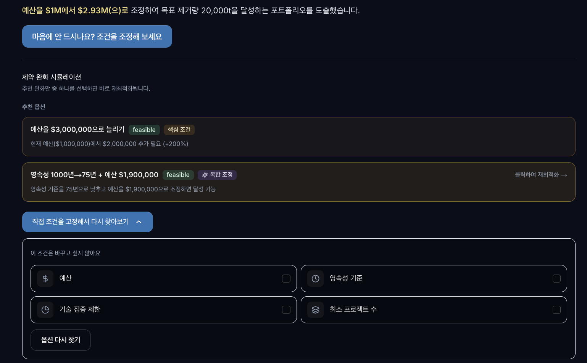
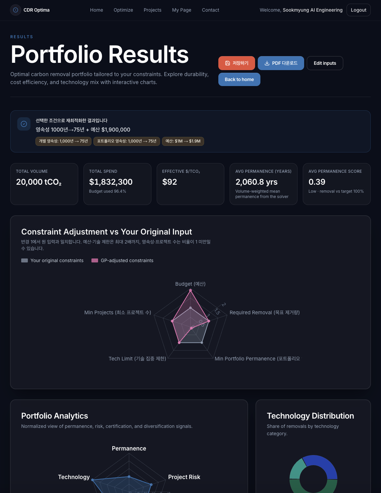
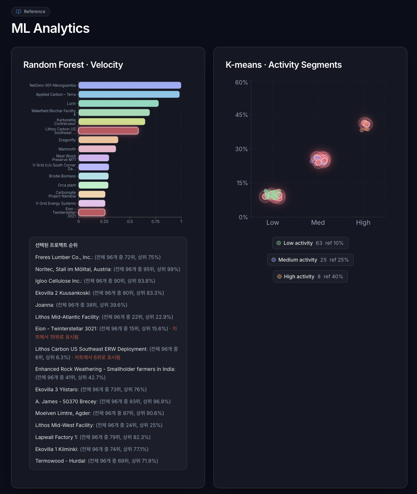
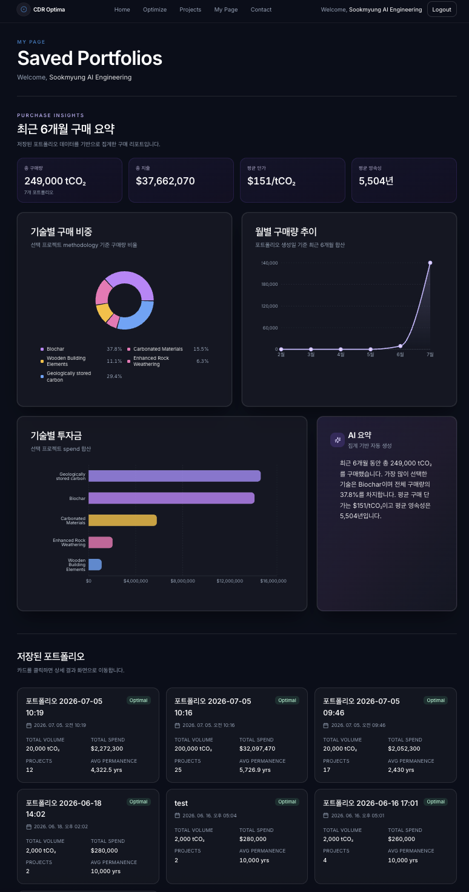

# CDR Optima - 🌍 Carbon Removal Portfolio Optimization Platform 
Built with Python, FastAPI, Next.js, PostgreSQL, Supabase, and Machine Learning.
# 탄소 제거 프로젝트(CDR) 포트폴리오 최적화 웹 서비스
> 기업이 Net zero 목표를 달성하기 위해 CDR 크레딧을 구매할 때,  
> 예산·영속성·기술 다양성 제약 조건 하에서 최적의 포트폴리오를 추천하는 AI 기반 의사결정 지원 시스템입니다.

🎥 Demo
https://www.youtube.com/watch?v=1WY_1JM98IM

✨ Velog
https://velog.io/@happyrachel/series/Carbon-Removal-Project

## 📷 Screenshots

### 1. Landing Page



### 2. Build Portfolio



### 3. Optimization Result



### 4. Constraint Adjustment



### 5. Re-optimization



### 6. ML Analysis



### 7. My Page



<br>

## 🎯 프로젝트 배경

비자발적 탄소시장(VCM)에서 기업이 CDR 크레딧을 구매할 때 직면하는 문제:
- 수십 개 프로젝트 중 어떤 조합이 **예산 안에서 최적**인가
- 영속성·기술 다양성 등 **다중 제약을 동시에 만족**하는 포트폴리오를 어떻게 구성하는가
- 수학적으로 최적인 결과가 **시장에서도 검증된 프로젝트**인가

이 문제를 MILP 최적화 + ML 분석 + LLM 설명의 3단 레이어로 해결합니다.

<br>

## 🏗️ 시스템 아키텍처

```
[Puro.earth Registry]
        ↓ Retirement Export
[Data Pipeline]
  transactions_raw.csv ──→ FeatureEngineer ──→ Random Forest (velocity score)
  projects_milp.csv   ──→ K-means (activity segment)
                      ──→ MILP Optimizer
                              ↓
[FastAPI Backend]
  POST /api/v1/optimize       → MILP 최적화
  POST /api/v1/optimize/gp    → Goal Programming (대안 탐색)
  GET  /api/v1/ml/random-forest → velocity score 차트
  GET  /api/v1/ml/k-means       → activity segment 시각화
  POST /api/v1/portfolios       → 결과 저장
  GET  /api/v1/portfolios/{id}/pdf → PDF 리포트
        ↓
[Next.js Frontend]
  최적화 입력 폼 → 결과 대시보드 → ML 분석 → 마이페이지
```

<br>

## 핵심 기능

### 1. MILP 포트폴리오 최적화
- 예산 / 목표 제거량 / 기술 집중 제한 / 영속성 / 최소 프로젝트 수 등 다중 제약 하 비용 최소화
- 최적해 없을 경우 Goal Programming으로 제약 조건을 중요도 순으로 단계적 완화
  - 페널티 가중치: 목표 제거량(λ=999) > 예산(λ=50) > 영속성(λ=10) > 기술 다양성/프로젝트 수(λ=3)
- GP 결과가 마음에 들지 않을 경우 조건 완화 시나리오를 사전 검증하여 실현 가능한 옵션만 제시하는 2차 최적화

### 2. ML 기반 시장성 분석 (현재 Random Forest이나, 성능 평가후 XGBoost로 교체 예정) 
- Random Forest — `days_to_retire` 예측으로 크레딧 유동성(velocity score) 산출
  - `GroupShuffleSplit(groups=projectId)`: 프로젝트 단위 train/test 분리로 data leakage 방지
- K-means — 6개 피처(거래량·영속성·최근활동성 등)로 프로젝트를 LOW/MEDIUM/HIGH_ACTIVITY 군집화
- SHAP(TreeExplainer) 적용 — 모델 예측 근거 정량화 및 시장 성숙도 효과 분석

### 3. 포트폴리오 저장 · 리포트
- 최적화 결과를 PostgreSQL(Supabase)에 저장
- 마이페이지에서 누적 포트폴리오 대시보드 · 개별 리포트 조회
- PDF 리포트 다운로드 (reportlab, 한글 폰트 지원)
- LLM(Claude API) 기반 AI 분석 요약
<br>

## 🛠️ 기술 스택

### Backend


### ML / Optimization


### Frontend


### Infra / DB


<br>

## 📊 데이터

- **출처**: [Puro.earth Registry](https://registry.puro.earth/retirements) — Retirement Export
- **규모**: 2,078건 거래 / 96개 프로젝트 / 8개 방법론
- **선택 이유**: Issuance(발행) 데이터가 아닌 Retirement(실제 상쇄 완료) 데이터를 사용하여 실제 시장 거래 패턴 분석 가능
- **전처리**: 23개 원본 컬럼 → 13개 분석 컬럼 필터 / `days_to_retire` 파생변수 생성 / 원-핫 인코딩
> ⚠️ 실거래 데이터 보안상 CSV 파일은 저장소에 포함되지 않습니다.

<br>

## 🔍 SHAP 분석 주요 발견

Random Forest에 SHAP TreeExplainer를 적용한 결과:

| 피처 | mean \|SHAP\| | 의미 |
|---|---|---|
| `completed_year` | 192일 | 거래 완료 연도 (시장 성숙도 효과) |
| `vintage` | 152일 | 크레딧 발행 연도 |
| `issued_year` | 87일 | issuanceDate 연도 |
| methodology / country 등 | 2일 이하 | 상대적으로 미미 |

날짜 변수 3개가 전체 SHAP 기여도의 **76%** 를 차지합니다.  
이는 단순한 data leakage가 아니라, **시장이 연도별로 성숙해지면서 거래 속도가 함께 증가하는 시장 성숙도 효과**로 해석됩니다.  
같은 연도 내에서도 methodology별 `days_to_retire` 차이가 유의하게 존재함을 추가 검증으로 확인했습니다.

<br>

## 📁 프로젝트 구조

```
cdr_optima/
├── api/
│   ├── routes_optimize.py     # MILP / GP 최적화 엔드포인트
│   ├── routes_ml.py           # RF · K-means 결과 제공
│   ├── routes_portfolios.py   # 포트폴리오 저장 · 조회 · PDF
│   └── routes_auth.py         # 더미 인증
├── services/
│   ├── milp_optimizer.py      # MILP + Goal Programming + 2차 최적화
│   ├── random_forest.py       # VelocityScoreModel
│   ├── kmeans_clustering.py   # RiskClusterer
│   ├── feature_engineering.py # FeatureEngineer (원-핫 인코딩)
│   ├── data_loader.py         # DataLoader (전처리 파이프라인)
│   └── portfolio_pdf.py       # PDF 리포트 생성
├── models/
│   ├── schemas.py             # Pydantic 스키마
│   └── (ORM 모델)             # SQLAlchemy User · Portfolio · PortfolioProject
├── scripts/
│   └── generate_projects_milp.py  # 데이터 업데이트 자동화 스크립트
└── data/
    └── (CSV 파일 — git 제외)
```

<br>

## 담당 파트

| 영역 | 담당 내용 |
|---|---|
| 데이터 파이프라인 | Puro.earth 데이터 수집·전처리, `generate_projects_milp.py` 자동화 스크립트 |
| ML 모델링 | Random Forest(GroupShuffleSplit), K-means, SHAP 분석 |
| 백엔드 | FastAPI 서버, MILP/GP 최적화 엔진, PDF 생성, DB 연동 |
| 프론트엔드 | Next.js 최적화 입력 폼, 결과 대시보드, ML 시각화, 마이페이지 |
| 데이터 분석 | EDA, 상관계수 분석, SHAP 기반 XAI 분석 (Velog 연재) |

<br>

## 분석 블로그 (Velog)

프로젝트의 데이터 분석 과정을 단계별로 정리하고 있습니다.
- [1편] 프로젝트 기획 및 개요
- [2편] EDA — 거래 단위 기초 통계 및 시각화
- [3편] EDA — 상관관계 분석 및 모델링 연결
- [4편] Random Forest + SHAP 분석 *(작성 중)*
- [5편] XGBoost 비교 실험 *(예정)*
- [6편] K-means 군집화 및 시각화 *(예정)*

<br>
## 개발 기간

2026.03 — 2026.08 (졸업 프로젝트, 진행 중)
<br>

## 팀 구성

3인 팀 (백엔드 · 프론트엔드 · ML · LLM)
---

> 본 저장소는 포트폴리오 목적으로 공개되며, 코드 전체는 졸업 심사 후 공개 예정입니다.
